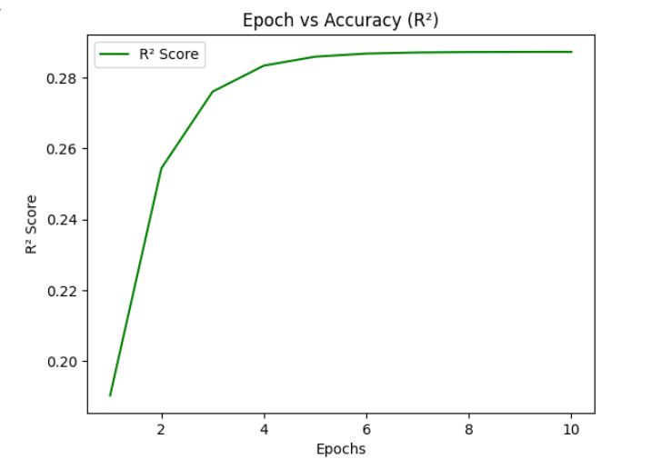

# Housing Price Prediction Based on Size using Linear Regression

## Overview
This project predicts house prices based on the area using **Stochastic Gradient Descent (SGD) Regressor**. The dataset used is `Housing.csv` which contains house **Area** and **Price**.(these are 2 column selected from 13 exixting column) The model is trained over multiple epochs, and we visualize its performance using three graphs: R² Score, Mean Squared Error (MSE), and Actual vs Predicted Prices.

---

## Dataset
- **Columns:**  
  - `Price` → Target variable (house price)  
  - `Area` → Feature (house area)  

- **Sample:**
| Price | Area |
|-------|------|
| 245000 | 1500 |
| 312000 | 1800 |
| 279000 | 1600 |

---

## Steps
1. Load dataset using **Pandas**.  
2. Select features (`Area`) and target (`Price`).  
3. Normalize both features and target using `StandardScaler`.  
4. Train `SGDRegressor` using gradient descent for multiple epochs.  
5. Track model performance using **R² Score** and **MSE** after each epoch.  
6. Visualize the results with graphs.

---

## Graphs

### 1. R² Score vs Epochs
  
> Shows how the model’s accuracy improves over training epochs. Closer to 1 means better fit.

### 2. MSE Loss vs Epochs
  
> Shows how prediction error decreases over epochs. Lower MSE is better.

### 3. Actual vs Predicted Prices
  
> Blue dots → Model predictions vs actual prices.  
> Orange dashed line → Perfect prediction line. The closer the dots to this line, the better the model.

---

## Final Model Output
- **Coefficient (Slope):** `<insert sgd.coef_[0]>`  
- **Intercept:** `<insert sgd.intercept_[0]>`  
- **Final R² Score:** `<insert r2_scores[-1]>`  

---
